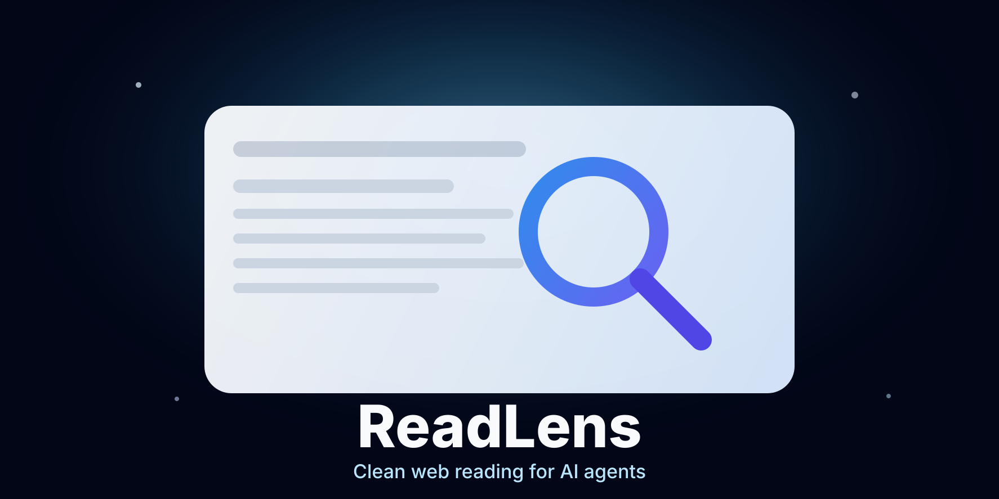

<p align="center">
  
</p>

# ReadLens

ReadLens is a local web content gateway for AI agents. It fetches a URL, extracts the readable main content, removes common page chrome, and returns a small structured result instead of a raw DOM.

> Clean web content for AI agents.

## Status

ReadLens is an early v0.1 implementation. It currently provides:

- HTTP-first reading with site-adapter and Lightpanda fallbacks
- A Medium site adapter that can read from the official author feed when direct pages are blocked or too small
- Mozilla Readability extraction
- `article`, `main`, text-density, and body-text fallbacks
- Text output with metadata and truncation
- Markdown output for headings, lists, links, quotes, and code
- Local file cache with a one-hour default TTL
- A local CLI
- A stdio MCP server with one `read_page` tool
- Private-network blocking by default

## Requirements

- Node.js 22 or newer
- [Lightpanda](https://lightpanda.io/) available on `PATH` for JavaScript-rendered pages

Lightpanda is optional when `--render never` is used. See the [installation guide](docs/installation.md) for Lightpanda, global npm, and development setup instructions.

## Quick start

```sh
npx -y readlens@latest read https://example.com
```

## CLI

Read a page as plain text:

```sh
readlens read https://example.com/article
```

Return the complete structured result:

```sh
readlens read https://example.com/article --json
```

Preserve semantic structure as Markdown:

```sh
readlens read https://example.com/article --format markdown
```

Control JavaScript rendering:

```sh
readlens read https://example.com/app --render auto
readlens read https://example.com/app --render always
readlens read https://example.com/article --render never
```

Limit returned content and show diagnostics:

```sh
readlens read https://example.com/article --max-chars 10000 --debug
```

Disable cache or change its TTL in seconds:

```sh
readlens read https://example.com/article --no-cache
readlens read https://example.com/article --cache-ttl 900
```

Cache files are stored under `$XDG_CACHE_HOME/readlens` or `~/.cache/readlens`.

`auto` is the default. It tries a normal HTTP request first, then invokes Lightpanda when the extracted content is too small.

## MCP server

ReadLens runs as a local stdio MCP server:

```sh
codex mcp add readlens -- npx -y readlens@latest mcp
claude mcp add readlens -- npx -y readlens@latest mcp
```

See the [MCP setup guide](docs/mcp.md) for Codex, Claude Code, Claude Desktop, OpenCode, and JSON-based clients.

The server exposes one tool:

```text
read_page(url, format = "text", render = "auto", maxChars = 100000)
```

Its result includes the final URL, title, author, site name, description, content, language, publication date, counts, extraction method, confidence heuristic, and truncation state.

Tool failures return stable codes such as `HTTP_STATUS`, `BLOCKED`, `FETCH_TIMEOUT`, and `EXTRACTION_FAILED`.

## Security

ReadLens accepts only HTTP and HTTPS URLs. It rejects localhost, private IPv4 ranges, loopback addresses, link-local addresses, and private IPv6 ranges by default. Redirect targets are validated before HTTP redirects are followed. Lightpanda is invoked with its private-network blocking option.

Local network access requires explicit opt-in:

```sh
readlens read http://127.0.0.1:8080 --allow-private
readlens mcp --allow-private
```

Treat `--allow-private` as a security-sensitive option, especially when an agent chooses URLs.

## Development

```sh
npm test
npm run typecheck
npm run build
npm run coverage
```

Coverage thresholds are set to 100% for statements, branches, functions, and lines.

## v0.1 boundaries

The first version intentionally does not include crawling, search, batch reading, embeddings, cloud hosting, authentication, a GUI, multiple browser engines, or cursor-based continuation.

## Contributing and security

See [CONTRIBUTING.md](CONTRIBUTING.md) for the development workflow and [SECURITY.md](SECURITY.md) for private vulnerability reporting guidance. Release changes are recorded in [CHANGELOG.md](CHANGELOG.md).
